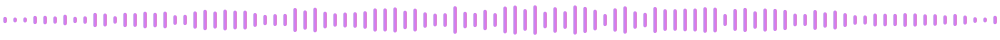

[`sobre mí`](#about) · [`enfoque`](#focus) · [`stack`](#stack) · [`contribuciones`](#contributions) · [`stats`](#stats)

## 01 · sobre mí

Estudio Ingeniería de Sistemas (8vo semestre) en Cartagena, Colombia. Lo que más me interesa es la ciberseguridad aplicada a DevSecOps y la arquitectura de software: cómo se diseña un sistema y cómo se protege una vez está en producción.

Uso Fedora todos los días, contribuyo a proyectos open source cuando puedo y me gusta entender cómo funcionan las cosas por dentro antes de darlas por hechas. :D

- **Ahora:** construyendo un [roadmap de redes para DevSecOps](https://github.com/Crisiszzz07/Networking-DevSecOps) (namespaces, netfilter, TLS/mTLS, CNI, eBPF), además de varios repos y proyectos privados.
- **También:** armando una rutina constante en [TryHackMe](https://tryhackme.com/p/Crisiszzz07) y buscando proyectos en GitHub a los que contribuir.
- **Practicando:** labs Red Team / Blue Team en máquinas virtuales, con Wazuh y MITRE ATT&CK.
- **Idiomas:** español nativo, inglés conversacional.

## 02 · enfoque

## 03 · stack

**Mi entorno de trabajo actual**

## 04 · contribuciones recientes

<!--recent:start-->
| # | repo | lo último | commits | fecha |
|:-:|---|---|:-:|--:|
| `01` | [**RF03-Middleware**](https://github.com/Crisiszzz07/RF03-Middleware) Java |  [docs(fix): error en las tablas del README](https://github.com/Crisiszzz07/RF03-Middleware/commit/c7ffa8470f47656431aa4fe11ca92bb4fc65714b) | 11 | 4 oct |
| `02` | [**LAB_architectural-design-patterns**](https://github.com/Crisiszzz07/LAB_architectural-design-patterns) TypeScript |  [feat: nuevo modo de evaluación grupal](https://github.com/Crisiszzz07/LAB_architectural-design-patterns/commit/814cef1834d2e3ad67b4a3f0f39af3a2d67d65f2) | 2 | 4 oct |
| `03` | [**Networking-DevSecOps**](https://github.com/Crisiszzz07/Networking-DevSecOps) TypeScript |  [feat(repaso): repaso espaciado con cajas Leitner](https://github.com/Crisiszzz07/Networking-DevSecOps/commit/9b2a835146157e143c9b538d7f387427968e2d0b) | 8 | 29 sep |
| `04` | [**STOCHASTIX**](https://github.com/Crisiszzz07/STOCHASTIX) TypeScript |  [Se agregan las funciones que faltaban(feat: agregar dist. Uniforme, i…](https://github.com/Crisiszzz07/STOCHASTIX/pull/1) | 16 | 28 sep |
| `05` | [**crmne/zapfast**](https://github.com/crmne/zapfast) Rust |  [Redact pairing credentials from logs](https://github.com/crmne/zapfast/pull/44) | 2 | 22 sep |
| `06` | [**SIMULACION_POLITICA_DEMANDA**](https://github.com/Crisiszzz07/SIMULACION_POLITICA_DEMANDA) CSS |  [modificación de lógica](https://github.com/Crisiszzz07/SIMULACION_POLITICA_DEMANDA/commit/afafb3ae4d22eee2f016c82cb6879756bd6517dc) | 2 | 22 sep |
| `07` | [**AlejoVP0411/random-lab**](https://github.com/AlejoVP0411/random-lab) TypeScript |  [h](https://github.com/AlejoVP0411/random-lab/commit/558de60ece771424540b6c08edf81755d9018856) | 9 | 14 sep |
| `08` | [**Water-Telemetry-Dashboard**](https://github.com/Crisiszzz07/Water-Telemetry-Dashboard) HTML |  [corrección para deploy](https://github.com/Crisiszzz07/Water-Telemetry-Dashboard/commit/b6bd6acdf7ef10ba6d7e79a2d30201782c46bf84) | 6 | 2 sep |

Últimos 12 meses · actualizado el 2026-10-05
<!--recent:end-->

## 05 · stats

<picture>
  <source media="(prefers-color-scheme: dark)" srcset="https://raw.githubusercontent.com/Crisiszzz07/Crisiszzz07/output/snake-dark.svg"/>
  <source media="(prefers-color-scheme: light)" srcset="https://raw.githubusercontent.com/Crisiszzz07/Crisiszzz07/output/snake-light.svg"/>
  
</picture>

 

<!--  -->

